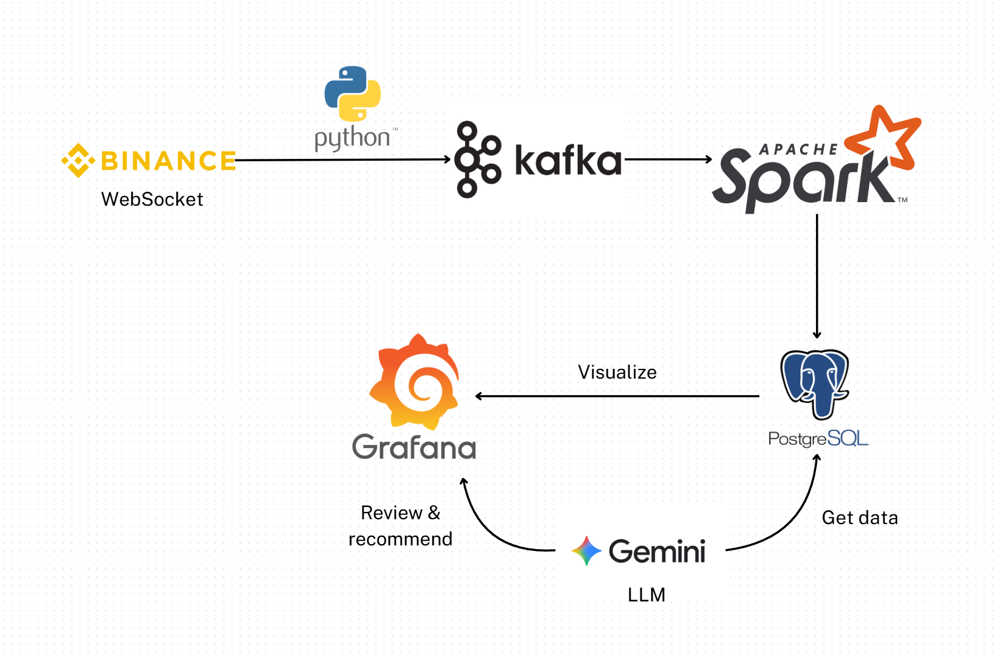

# Real-time Crypto Market Data Processing System

## Teammates
| Student ID | Name              | GitHub       | Role                                                 |
| ---------- | ----------------- | ------------ | ----------------------------------------------------- |
| 22133026   | Nguyễn Quốc Huy   | [@huy-dataguy](https://github.com/huy-dataguy) | Money Flow Index (MFI) & Donchian Channels (DC)       |
| 22133029   | Nguyễn Nam Hy     | [@ngnamhy](https://github.com/ngnamhy)     | Aroon Indicator & Average Directional Index (ADX)     |
| 22133045   | Nguyễn Minh Quang | [@DOCUTEE](https://github.com/DOCUTEE)    | On-Balance Volume (OBV) & Bollinger Bands             |
| 22133056   | Nguyễn Quốc Thịnh | [@Jayus52Hz](https://github.com/Jayus52Hz)   | Relative Strength Index (RSI) & Stochastic Oscillator |
| 22133064   | Lưu Vĩnh Tường    | [@Wal-Liu](https://github.com/Wal-Liu)     | Volume & Moving Average (MA)                          | 
## Introduction
Our team builds a `real-time data pipeline` system to automatically collect, calculate financial technical indicators, and instantly visualize market analysis results in the cryptocurrency market. This system helps users monitor and evaluate the market for faster and more accurate decision-making.

## Data Source
The primary data source is the `Binance WebSocket Streams`, which provide candlestick data for specific trading pairs every second (UTC+0). The data includes open time, open price, high price, low price, close price, trading volume, close time, quote asset volume, number of trades, and active buyer volume.

Specifically, we use two main data types:
- `trade` (actual trades)
- `kline_1m` (candlestick data updated every minute)

Tracking data for three coins: `BTC`, `BNB`, `ETH`.

## Technical Indicators Calculated

* **QBV (Quote-Based Volume):** Measures market activity intensity based on quote volume.
* **BB (Bollinger Bands):** Identifies volatility and potential breakout zones.
* **Volume MA (Moving Average of Volume):** Tracks average trading volume trends over time.
* **RSI (Relative Strength Index):** Evaluates momentum and overbought/oversold market conditions.
* **MFI (Money Flow Index):** Combines price and volume to assess buying and selling pressure.
* **Aroon:** Detects trend strength and potential trend reversals.
* **ADX (Average Directional Index):** Quantifies overall market trend strength.


## System Architecture
- **Ingestion**: Python connects to Binance WebSocket to continuously stream market data and publishes it to Apache Kafka for buffering and distribution.

- **Stream Processing**: Apache Spark consumes data from Kafka, processes real-time metrics, computes analytics, and detects trading patterns or anomalies.

- **Storage & Visualization**: Processed data is persisted in PostgreSQL for query and analysis. Grafana connects to PostgreSQL to visualize key insights and market trends.

- **AI Integration**: Gemini (LLM) retrieves data from PostgreSQL, reviews Grafana dashboards, and provides automated recommendations or insights for decision-making.



## Demo

### Volume and MA 
https://github.com/user-attachments/assets/5afb524f-54a6-4708-a5b8-4ec03f9339b5

## Technologies Used
- Python, Apache Kafka, Apache Spark
- PostgreSQL, Grafana
- Binance WebSocket API

## Usage Instructions

### Start project
```
docker compose up -d
```

### QBV
```
docker exec binance-spark-master /opt/spark/bin/spark-submit \
  --master spark://spark-master:7077 \
  --packages org.apache.spark:spark-sql-kafka-0-10_2.12:3.5.0,org.postgresql:postgresql:42.6.0 \
  /opt/workspace/trend/src/QBV.py
```

### BB
```
docker exec binance-spark-master /opt/spark/bin/spark-submit \
  --master spark://spark-master:7077 \
  --packages org.apache.spark:spark-sql-kafka-0-10_2.12:3.5.0,org.postgresql:postgresql:42.6.0 \
  /opt/workspace/trend/src/BB.py
```

### Volume and MA
```
docker exec binance-spark-master ./volume/src/submit.sh
```

### RSI
```
docker exec binance-spark-master ./momentum/src/run_RSI.sh
```

### MFI
```
docker exec binance-spark-master ./momentum/src/run_stochastic_oscillator.sh
```

### Aroon
```
docker exec binance-spark-master ./aroon/src/run_Aroon.sh
```

### Adx
```
docker exec binance-spark-master ./adx/src/run_Adx.sh
```